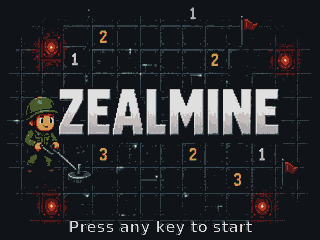
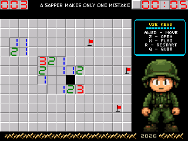

# ZealMine

Minesweeper for the [Zeal 8-bit OS](https://github.com/Zeal8bit/Zeal-8-bit-OS),
written in C for the Z80. It ships as a single keyboard-driven init program
that boots straight from the OS disk and stays inside the kernel's 48 KiB init
RAM limit.

**Version: `v0.1.0-rc1`**

## Screenshots





## Features

- Classic minesweeper: reveal a cell, flag a mine, chord (reveal neighbours)
  with a press on an already-open cell.
- Fixed 14x12 board with 30 mines.
- HUD row: mines left counter, sapper banner, and an MM:SS timer.
- Title screen, retro divider and soldier background pics, keys hint, and
  dedicated win / lose banners that swap the soldier's pose in place.
- Keyboard and gamepad controls (arrows/WASD, Z/Space, X, R, Q).
- Assets and levels are deterministic from generated data; the field seed
  mixes hardware entropy at start.

## How it fits the 48 KiB init limit

The OS init loader (`LOADER_BIN_MAX_SIZE`, `0xC000`) loads the program to
`0x4000`, so the whole binary must stay under 49 151 bytes. 8-bit tiles at
256 B each grow faster than the code, so the versioned tilesets (`tiles.zts`,
`title.zts`) are packed with a small whole-stream LZ77 codec (window 256,
see `src/tileset_lz77.c` / `tools/gif2tiles.py`) and decoded straight into
video RAM on boot. The RC1 build is **43 343 bytes** and a prebuilt copy is
committed as `bin/zealmine.bin`.

## Controls

| Action                | Keys                               |
|-----------------------|------------------------------------|
| Move the cursor       | Arrows / W A S D                   |
| Reveal / chord        | Z / Space                          |
| Flag a mine           | X                                  |
| Restart               | R                                  |
| Quit (back to the OS) | Q                                  |

## Building

Requirements:

- [Zeal 8-bit OS](https://github.com/Zeal8bit/Zeal-8-bit-OS) SDK and CMake
  toolchain (`ZOS_PATH`)
- [Zeal VideoBoard SDK](https://github.com/Zeal8bit/Zeal-8-bit-VideoBoard-SDK)
  (`ZVB_SDK_PATH`)
- [zeal-game-dev-kit](https://github.com/Zeal8bit/zeal-game-dev-kit) (`ZGDK_PATH`)
- [zeal-coreutils](https://github.com/Zeal8bit/zeal-coreutils) (`COREUTILS_PATH`)
- SDCC, CMake >= 3.16
- Python 3 with Pillow (asset pipeline, checks)

Configure a `zealenv.sh`-style environment that exports the paths above, then:

```sh
source zealenv.sh
cmake -S . -B build
cmake --build build -j
```

The result lands in `bin/zealmine.bin`. The tile assets are regenerated from
the source GIFs in `assets/` at build time by `tools/`.

## Running

Under the reference emulator, with the OS image that carries the disk:

```sh
zeal-native --rom path/to/zos/os_with_romdisk.img -u bin/zealmine.bin
```

A bootable disk image for real hardware can be produced with the Zeal-8-bit-OS
tools; the built binary is flashed there as the init program.

## Real hardware

This game has been tested **only under the Zeal 8-bit OS reference
emulator** — the author does not have a Zeal 8-bit computer at hand. There is
**no guarantee it works on real hardware** (timing, video timing, SD/ROM
behaviour and input can all differ), although nothing platform-specific is
used beyond the standard SDK APIs. Testing on real hardware is very welcome.

## Testing

Host-side unit tests for the field logic:

```sh
cc -std=c99 -Wall -Wextra -o test_field tests/test_field.c src/field.c
./test_field
```

Asset sanity checks live in `tools/`:

```sh
python tools/check_digits.py --zts build/assets/tiles.zts \
    --ztp build/assets/tiles.ztp --header src/zealmine.h
python tools/dump_tiles.py
python tools/preview_title.py -a build/assets
```

## Layout

```
assets/    source GIFs (tiles, title, banners, soldier poses)
src/       game, renderer, field logic, LZ77 tileset decoder
tools/     asset generators, checks, emulator driver (run_emu.py)
tests/     host C unit tests
docs/      screenshots
bin/       prebuilt release binary (RC1)
```

## License

[MIT](LICENSE)